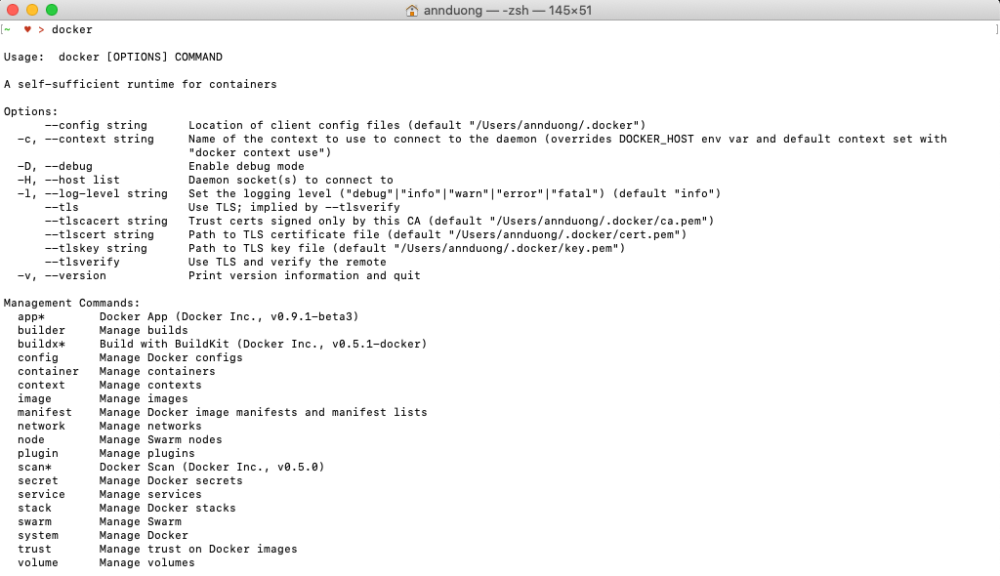
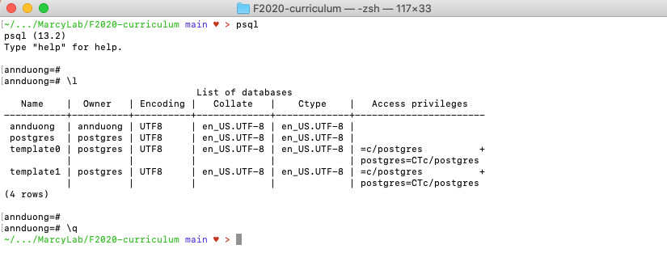
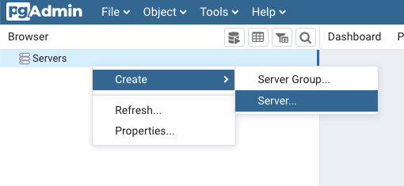
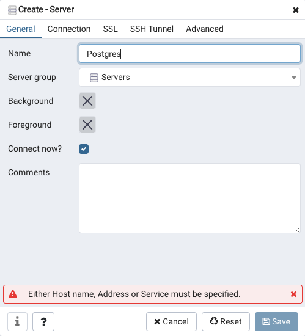
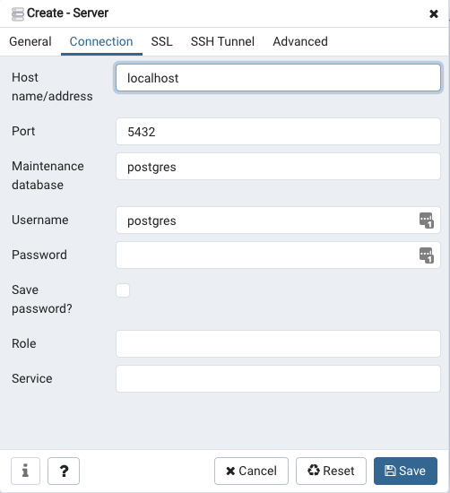

# SE Unit 7 Installation Checklist
This check list is to ensure you install Docker, PostgreSQL, and pgAdmin **and that you've install them correctly**.

# Install Docker

Download Docker [here](https://docs.docker.com/get-docker/)

You need to use docker via the command line. To test if you've installed everything correctly, run `docker` in your terminal. You should not get an error.

### If you get an error, try:
* Starting the Docker desktop app
* Restarting your Terminal and running the `docker` command again

# Install PostgreSQL

Download PostgreSQL [here](https://www.postgresql.org/download/)

You need to use PostgreSQL via the command line. To test if you've install everything correctly, run `psql` in your terminal.

You should not get an error. Type `\l` in order to display the current databases you have. You should see at least two, one of which is named `postgres` and the other named after your computer's username.

Type `\q` to quite Postgres.

### If you get an error:
* You may have installed postgres, but forgot to install the comand line tools

# Install pgAdmin

[Download pgAdmin here](https://www.pgadmin.org/download/)

## pgAdmin Set Up Instructions

pgAdmin is a UI used to interact with your Postgres databases.

1. Open pgAdmin and Create a Server

2. Name your server "Postgres"

3. Click on the "Connection" tab and type a Host of "localhost". Click Save.

4. You should be able to expand "Servers", then expand "Postgres", then expand "Databases" and see the same database names you were able to see using `psql`.
